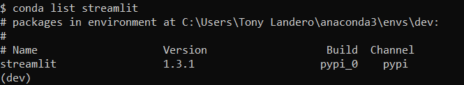

# Sign_and_Send_Ethereum_Transactions
Create a Streamlit application that allows users to complete Ethereum Blockchain Transactions Using the Ganache Network

---

## Technologies

This project leverages python 3.7 with the following packages:

**[Streamlit Library](https://docs.streamlit.io/)** - Streamlit is an open-source Python library that makes it easy to create and share beautiful, custom web apps for machine learning and data science.<br>

**[Dataclasses Library](https://docs.python.org/3/library/dataclasses.html)** - This module provides a decorator and functions for automatically adding generated special methods such as __init__() and __repr__() to user-defined classes.<br>

**[Typing Library](https://docs.python.org/3/library/typing.html)** - This module provides runtime support for type hints. The most fundamental support consists of the types Any, Union, Callable, TypeVar, and Generic.<br>

**[Web3.py Library](https://web3py.readthedocs.io/en/stable/)** - Web3.py is a Python library for interacting with Ethereum. It’s commonly found in decentralized apps (dapps) to help with sending transactions, interacting with smart contracts, reading block data, and a variety of other use cases.<br>

**[OS Library](https://docs.python.org/3/library/os.html)** - This module provides a portable way of using operating system dependent functionality.<br>

**[Requests Library](https://docs.python-requests.org/en/latest/)** - Requests allows you to send HTTP/1.1 requests extremely easily. There’s no need to manually add query strings to your URLs, or to form-encode your POST data.<br>

**[Dotenv Library](https://pypi.org/project/python-dotenv/)** - Python-dotenv reads key-value pairs from a .env file and can set them as environment variables.<br>

**[Bip44 Library](https://pypi.org/project/bip44/)** - Simple Python bip44 implementation. Mnemonic + bip32.<br>

---

## Installation Guide

Before running the application first install the following dependencies:

1. Streamlit:

To check if you have streamlit installed, run the following code from your terminal:

```python
conda list streamlit
```

If it is installed, you should see the verison number as the following image shows:



If not installed on your computer yet, run the following code from your terminal:

```python
pip install streamlit
```

2. Typing:

To check if you have typing installed, run the following code from your terminal:

```python
conda list typing
```

If it is installed, you should see the version number as the following image shows:


If not installed on your computer yet, run the following code from your terminal:

```python
pip install typing
```

3. Web3.py:

To check if you have Web3.py installed, run the following code from your terminal:

```python
conda list web3
```

If it is installed, you should see the version number as the following image shows:


If not installed on your computer yet, run the following code from your terminal:

```python
pip install web3
```

4. Requests:

To check if you have requests installed, run the following code from your terminal:

```python
conda list requests
```

If it is installed, you should see the version number as the following image shows:


If not installed on your computer yet, run the following code from your terminal:

```python
pip install requests
```

5. Dotenv:

To check if you have dotenv installed, run the following code from your terminal:

```python
conda list dotenv
```

If it is installed, you should see the version number as the following image shows:


If not installed on your computer yet, run the following code from your terminal:

```python
pip install python-dotenv
```