# Sign_and_Send_Ethereum_Transactions
Create a Streamlit application that allows users to complete Ethereum Blockchain Transactions Using the Ganache Network

---

## Technologies

This project leverages python 3.7 with the following packages:

**[Streamlit Library](https://docs.streamlit.io/)** - Streamlit is an open-source Python library that makes it easy to create and share beautiful, custom web apps for machine learning and data science.<br>

**[Dataclasses Library](https://docs.python.org/3/library/dataclasses.html)** - This module provides a decorator and functions for automatically adding generated special methods such as __init__() and __repr__() to user-defined classes.<br>

**[Typing Library](https://docs.python.org/3/library/typing.html)** - This module provides runtime support for type hints. The most fundamental support consists of the types Any, Union, Callable, TypeVar, and Generic.<br>

**[Web3.py Library](https://web3py.readthedocs.io/en/stable/)** - Web3.py is a Python library for interacting with Ethereum. It’s commonly found in decentralized apps (dapps) to help with sending transactions, interacting with smart contracts, reading block data, and a variety of other use cases.<br>

**[OS Library](https://docs.python.org/3/library/os.html)** - This module provides a portable way of using operating system dependent functionality.<br>

**[Requests Library](https://docs.python-requests.org/en/latest/)** - Requests allows you to send HTTP/1.1 requests extremely easily. There’s no need to manually add query strings to your URLs, or to form-encode your POST data.<br>

**[Dotenv Library](https://pypi.org/project/python-dotenv/)** - Python-dotenv reads key-value pairs from a .env file and can set them as environment variables.<br>

**[Bip44 Library](https://pypi.org/project/bip44/)** - Simple Python bip44 implementation. Mnemonic + bip32.<br>

---

## Installation Guide

Before running the application first install the following dependencies:

1. Streamlit:

To check if you have streamlit installed, run the following code from your terminal:

```python
conda list streamlit
```

If it is installed, you should see the verison number as the following image shows:


If not installed on your computer yet, run the following code from your terminal:

```python
pip install streamlit
```

2. Typing:

To check if you have typing installed, run the following code from your terminal:

```python
conda list typing
```

If it is installed, you should see the version number as the following image shows:

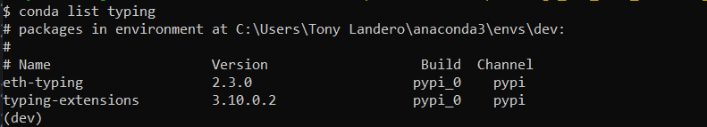

If not installed on your computer yet, run the following code from your terminal:

```python
pip install typing
```

3. Web3.py:

To check if you have Web3.py installed, run the following code from your terminal:

```python
conda list web3
```

If it is installed, you should see the version number as the following image shows:

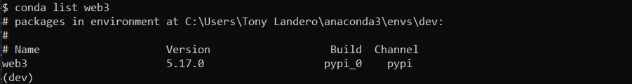

If not installed on your computer yet, run the following code from your terminal:

```python
pip install web3
```

4. Requests:

To check if you have requests installed, run the following code from your terminal:

```python
conda list requests
```

If it is installed, you should see the version number as the following image shows:

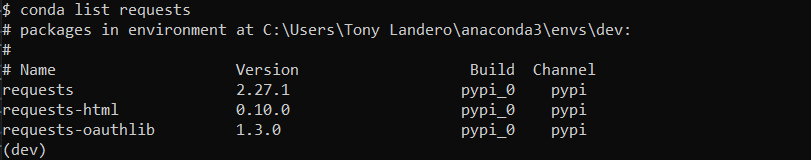

If not installed on your computer yet, run the following code from your terminal:

```python
pip install requests
```

5. Dotenv:

To check if you have dotenv installed, run the following code from your terminal:

```python
conda list dotenv
```

If it is installed, you should see the version number as the following image shows:

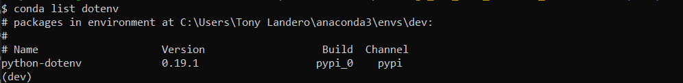

If not installed on your computer yet, run the following code from your terminal:

```python
pip install python-dotenv
```

6. Bip44:

To check if you have bip44 installed, run the following code from your terminal:

```python
conda list bip44
```

If it is installed, you should see the version number as the following image shows:

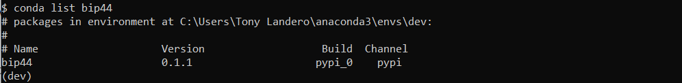

If not installed on your computer yet, run the following code from your terminal:

```python
pip install bip44
```

---

## Usage Guide

To use the 'Sign_and_Send_Ethereum_Transactions' application, simply clone the repository and type **streamlit run fintech_finder.py** in your terminal.

Step 1: Verify that your Ethereum (Ganache) Account information is correct. This includes your account address, as well as your balance:

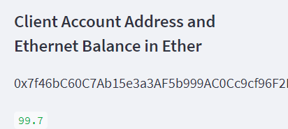

Step 2: Select a Fintech Professional and the number of hours you need them to work

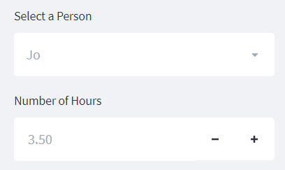

As you can see, for this example we are selecting to work with Jo, and we need her to work 3.50 hours.

Step 3: Verify that the selected person's Ethereum Account address and their hourly wage is correct:

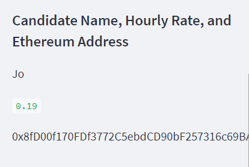

We can see Jo's account address and her hourly rate in ether. 

Step 4: Verify that the total wage calculation is correct. Then click on `Send Transaction`:

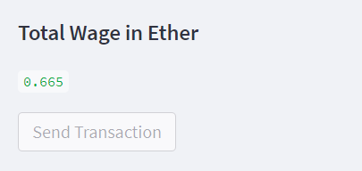

We can see that Jo's total wage should be 0.665 ether (3.5 hours x 0.19 hourly wage). 

Step 5: Verify that you receive a transaction has. This signifies that your transaction has been signed and sent:

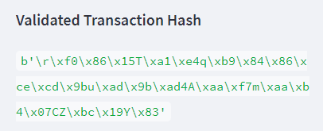

We can see that we received a bit encoded transaction hash. This lets us know that our transaction was sent. 

Step 6: Verify your account address and balance on Ganache:

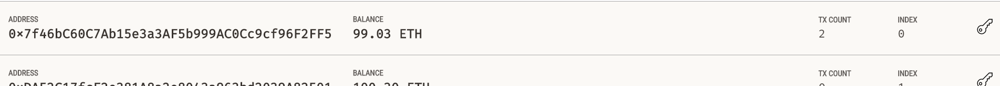

We can see that we have a balance of 99.03 ether and we have executed 2 transactions from our account.

Step 7: Verify your block history to check if transaction is part of the blockchain:

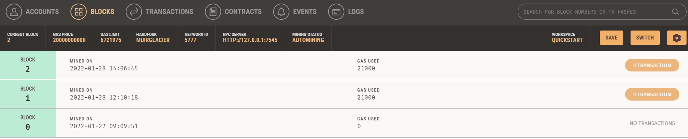

We can see that we have 3 blocks in this chain (1 Genesis Block and 2 Transaction Blocks). This also verifies our 2 transactions from our balance history.

Step 8: Verify transaction history to check that your latest transaction is displayed:

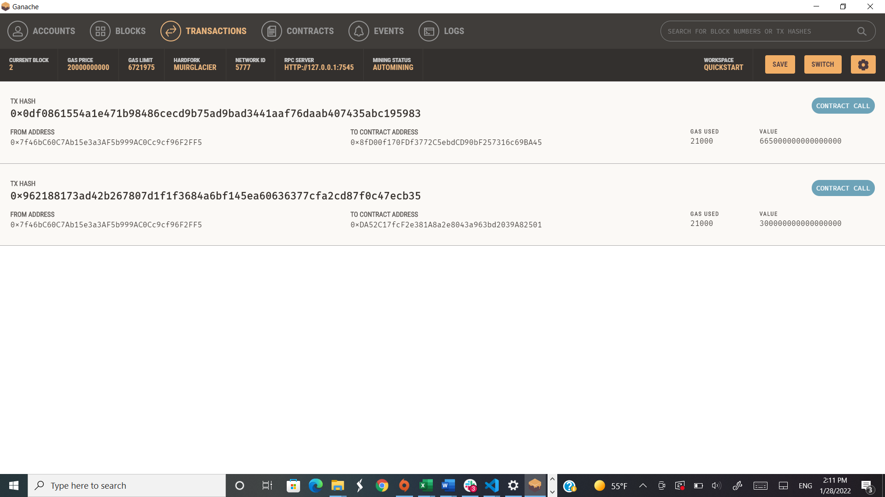

We can see our 2 transactions here. The transaction on top is the latest transaction. We can see the sender and receipient addresses, the amount of gas used to mine the transaction, as well as the value of the transaction in wei. 

Step 9: Click on the `latest` transaction hash to review the transaction details:

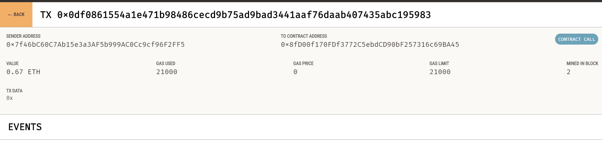

In this transaction receipt we can see the sender, receipient, the gas, and the value of the transaction. 

We are now done with our transaction. We signed, sent, and verified this transaction. We validated the completion by logging into Ganache and reviewing the transaction and block history. We also looked at the receipt from our transaction's hash to verify the transaction information. 
Congratulations! You have just signed and sent an Ethereum Transaction. 

---

## Contributors

**Created by:** Tony Landero<br>
**Email:** mr.landero@gmail.com<br>

---

## License

MIT